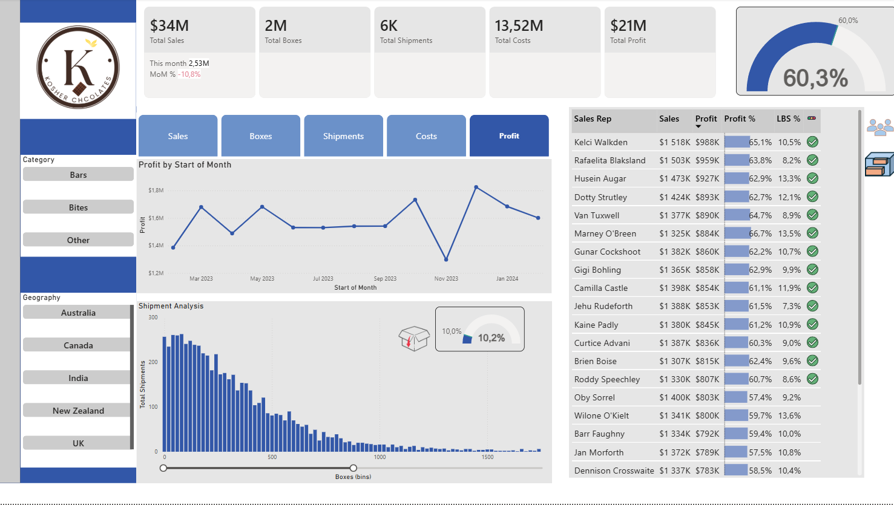
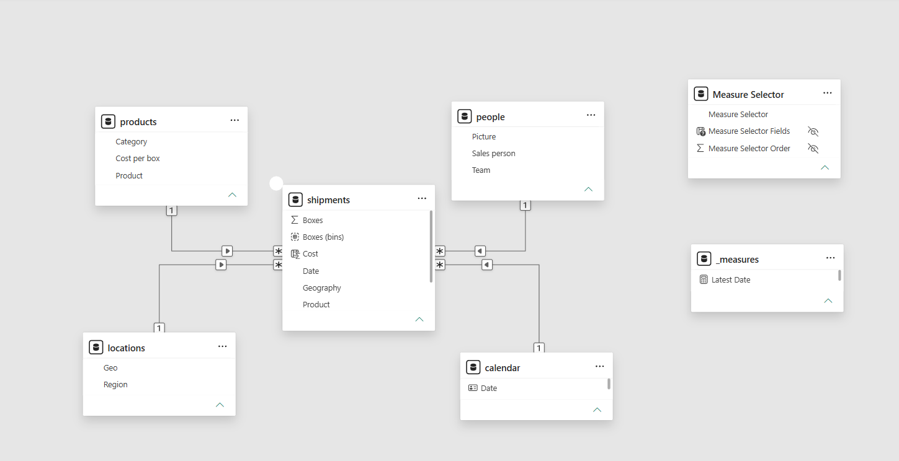
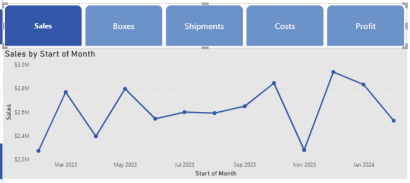
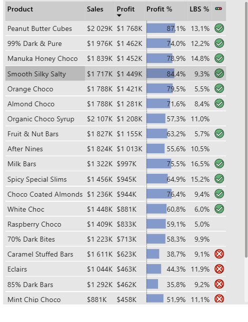
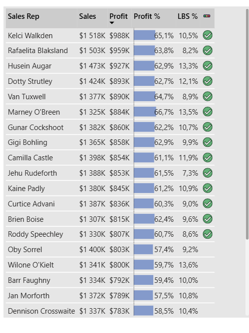
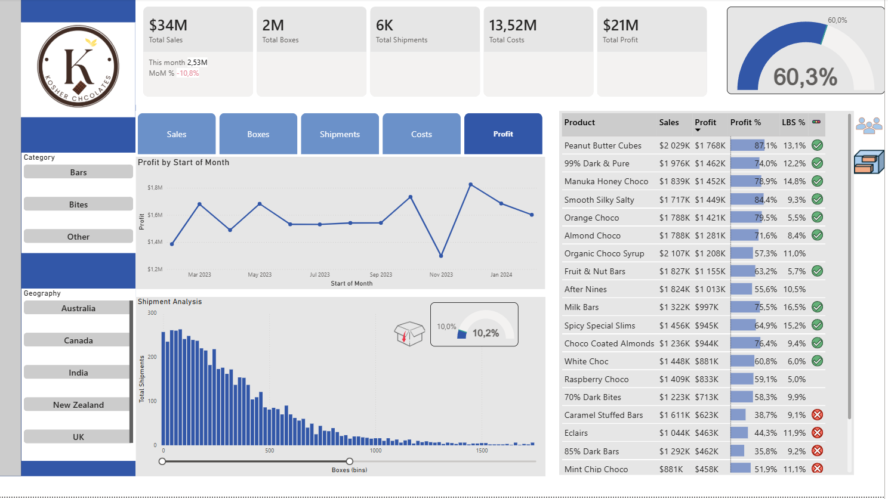

# Kosher Chocolates Sales Analytics

An end-to-end **Business Intelligence (BI) and Sales Analytics** solution built in Microsoft Power BI to transform transactional shipment data into an interactive management reporting environment.



## Table of Contents

- [Project Overview](#project-overview)
- [Business Problem](#business-problem)
- [Business Intelligence Objectives](#business-intelligence-objectives)
- [Dataset](#dataset)
- [Data Model](#data-model)
- [BI Development Approach](#bi-development-approach)
- [Dashboard Features](#dashboard-features)
- [Key Performance Indicators](#key-performance-indicators)
- [Key Business Insights](#key-business-insights)
- [Business Impact](#business-impact)
- [Recommendations](#recommendations)
- [Tools and Technologies](#tools-and-technologies)
- [Skills Demonstrated](#skills-demonstrated)
- [Project Structure](#project-structure)
- [Conclusion](#conclusion)

## Project Overview

The Kosher Chocolates Sales Analytics project is an end-to-end **Business Intelligence reporting solution** developed in Microsoft Power BI.

The project transforms raw shipment and sales transactions into a structured analytical model and interactive dashboard designed to help management monitor **sales performance, profitability, shipment activity, product performance, geographic performance, and sales representative performance**.

The objective is to move from transactional data to actionable business insight through **data transformation, dimensional modelling, DAX measures, KPI reporting, interactive visualisation, and performance analysis**.

## Business Problem

Kosher Chocolates required a centralised reporting solution to help management:

- Monitor overall sales performance
- Track month-over-month sales movement
- Analyse profitability and profit margins
- Identify high-performing products and categories
- Compare sales performance across geographies
- Monitor sales representative performance
- Analyse shipment and box volumes
- Identify areas of underperformance and potential growth
- Support data-driven operational and commercial decisions

The Power BI solution consolidates these analytical requirements into an interactive BI reporting environment.

## Business Intelligence Objectives

The dashboard was designed around five core BI questions:

1. **Performance:** How is the business performing in sales and profitability?
2. **Trend:** How are sales changing over time?
3. **Product:** Which products and categories are driving revenue and profit?
4. **Geography:** Which markets are contributing most to sales?
5. **People & Operations:** Which sales representatives are performing well, and how is shipment activity changing?

## Dataset

The source excel workbook contains three main components:

| Component | Purpose |
|---|---|
| Shipment Data | Transaction-level sales, shipment, product, geography, date, and box information |
| Dimension Data | Product categories, product costs, geography/region mappings, sales representatives, and teams |
| Calendar Table | Date dimension used for time-based analysis |

### Dataset Profile

- **6,113** shipment records
- **22** products
- **25** sales representatives
- **6** geographies
- **3** product categories: Bars, Bites, Other
- Reporting period: **February 2023 – February 2024**
- Total Sales: **$34.04M**
- Total Boxes: **2.08M**
- Total Costs: **$13.52M**
- Total Profit: **$20.52M**
- Profit Margin: **60.3%**

> The KPI values above reflect the current dashboard/data snapshot included in this repository.

## Data Model

The solution uses a **star-schema approach** with the shipment data serving as the central transactional table and supporting dimensions for products, people, locations, and dates.

The model also includes supporting measure/selector tables used to drive the interactive KPI and metric views.



### Why the model matters

The dimensional model separates transactional data from descriptive attributes, making the report easier to analyse and maintain while supporting reusable DAX measures and consistent filtering across the dashboard.

## BI Development Approach

The project follows a practical BI workflow:

**Source Data → Data Transformation → Data Modelling → DAX Measures → KPI Development → Interactive Reporting → Business Insights**

### 1. Data Transformation
- Cleaned and structured source data
- Standardised geography and dimensional attributes
- Prepared data for analytical modelling

### 2. Data Modelling
- Built a star-schema style model
- Connected shipment transactions to product, people, location, and calendar dimensions
- Added supporting measure tables

### 3. DAX & KPI Development
Developed measures for:
- Sales
- Boxes
- Shipments
- Costs
- Profit
- Profit Margin
- Month-over-Month performance
- Time-based trend analysis

### 4. Interactive Reporting
Built an executive-style dashboard using:
- KPI cards
- Line charts
- Shipment distribution analysis
- Gauges
- Detail tables
- Slicers
- Conditional formatting
- Metric selectors
- Interactive filtering

## Dashboard Features

### Executive KPI Overview

The dashboard provides a high-level view of:

- Total Sales
- Total Boxes
- Total Shipments
- Total Costs
- Total Profit
- Profit Margin
- Current month sales
- Month-over-month sales movement

### Sales Trend Analysis

The trend view enables management to identify monthly sales peaks, declines, and changes in performance over the reporting period.



### Product Performance

The product analysis view compares products by:

- Sales
- Profit
- Profit %
- Low Box Shipment (LBS) %

This supports product-level performance monitoring and helps identify products that combine strong revenue with healthy profitability.



### Sales Representative Performance

The sales representative view provides a ranked performance table containing:

- Sales
- Profit
- Profit %
- LBS %
- Performance status indicators



### Executive Dashboard Views

Two dashboard views are included to show the interactive report from different analytical perspectives:

<table>
<tr>
<td width="50%">

</td>
<td width="50%">

</td>
</tr>
</table>

## Key Performance Indicators

| KPI | Current Result |
|---|---:|
| Total Sales | $34.04M |
| Total Boxes | 2.08M |
| Total Shipments | 6.11K |
| Total Costs | $13.52M |
| Total Profit | $20.52M |
| Profit Margin | 60.3% |
| Latest MoM Sales Change | -10.8% |

## Key Business Insights

### Category Performance

- **Bars** generated approximately **$17.08M**, making it the largest sales category.
- **Bites** generated approximately **$10.15M**.
- **Other** generated approximately **$6.82M**.

This indicates that Bars are the largest revenue contributor and should remain an important focus for inventory and commercial planning.

### Product Profitability

The dashboard highlights significant differences in product profitability.

For example, **Peanut Butter Cubes** generates strong sales with a particularly high profit percentage, while several lower-margin products require closer profitability monitoring.

The dashboard  supports a more detailed view than just revenue alone by allowing stakeholders to evaluate both **sales contribution and profitability**.

### Geographic Performance

Sales are relatively balanced across the six countries in the dataset.

- New Zealand recorded the highest sales contribution in the current dataset.
- Canada and Australia also performed strongly.
- The UK recorded the lowest total sales among the six geographies.

This suggests that geographic performance should be managed through targeted market strategies rather than relying only on overall regional comparisons.

### Sales Trends

Monthly sales show several peaks and troughs throughout the reporting period, indicating fluctuations in demand.

The latest month shows a **10.8% month-over-month decline**, creating an opportunity for management to investigate the underlying drivers by product, geography, and sales representative.

### Sales Representative Performance

The sales representative table provides a management view of individual performance and uses status indicators to highlight performance against the selected dashboard criteria.

This enables our managers to identify strong performers, investigate underperformance, and use performance data to support coaching and incentive decisions towards personal.

## Business Impact

The dashboard creates value by turning fragmented transactional data into a centralised **Business Intelligence reporting layer**.

### Value Delivered

- Faster access to management information
- Reduced reliance on manual spreadsheet-based reporting
- Centralised KPI monitoring
- Interactive filtering for quicker root-cause analysis
- Improved visibility into product profitability
- Better monitoring of geographical regional performance
- Greater visibility into sales representative performance
- Stronger support for inventory, sales, and promotional planning
- A reusable analytical model for future reporting enhancements

The solution demonstrates how BI can convert operational sales data into a decision-support tool rather than simply presenting historical numbers.

## Recommendations

### 1. Investigate the Latest MoM Decline
The latest month shows a **10.8% decline in sales**. Management should drill into product, geography, and sales representative performance to identify the primary causes.

### 2. Protect High-Margin Products
Prioritise high-margin products in promotional, inventory, and sales planning while reviewing the cost structure and pricing of lower-margin products.

### 3. Strengthen Underperforming Markets
Use geographic-level analysis to identify markets with weaker sales and develop targeted commercial or promotional strategies.

### 4. Use Sales Performance for Coaching
Use the sales representative performance table to identify coaching opportunities, recognise strong performers, and align incentives with measurable business outcomes.


## Tools and Technologies

- **Microsoft Power BI**
- **Power Query**
- **DAX (Data Analysis Expressions)**
- **Dimensional Data Modelling**
- **Star Schema**
- **Interactive Data Visualisation**
- **Business Intelligence Reporting**
- **Excel**

## Skills Demonstrated

- Business Intelligence reporting
- Data cleaning
- Data transformation
- Data modelling
- Star-schema design
- DAX measure development
- KPI development
- Time-series analysis
- Profitability analysis
- Sales performance analysis
- Executive dashboard design
- Data storytelling
- Business recommendations

## Project Structure

```text
Kosher-Chocolates-Sales-Analytics/
│
├── README.md
│
├── data/
│   └── Chocolate Sales Dataset.xlsx
│
├── images/
│   ├── dashboard-overview-sales-reps.png
│   ├── dashboard-overview-products.png
│   ├── sales-trends.png
│   ├── product-performance.png
│   ├── sales-rep-performance.png
│   └── star-schema.png
│
├── powerbi/
│   └── Sales Analytics Dashboard.pbix
│
└── docs/
    └── Kosher Chocolates Sales Analytics ReadMe.docx
```

## Conclusion

The Kosher Chocolates Sales Analytics project demonstrates how **Business Intelligence, dimensional modelling, DAX, and interactive visualisation** can transform transactional sales data into a practical management reporting solution.

The dashboard enables stakeholders to monitor KPIs, analyse sales trends, evaluate product and geographic performance, assess sales representative performance, and identify opportunities for operational and commercial improvement.

The project demonstrates practical capability across the BI lifecycle — from **raw data preparation and modelling through to executive reporting, insight generation, and business recommendations**.
